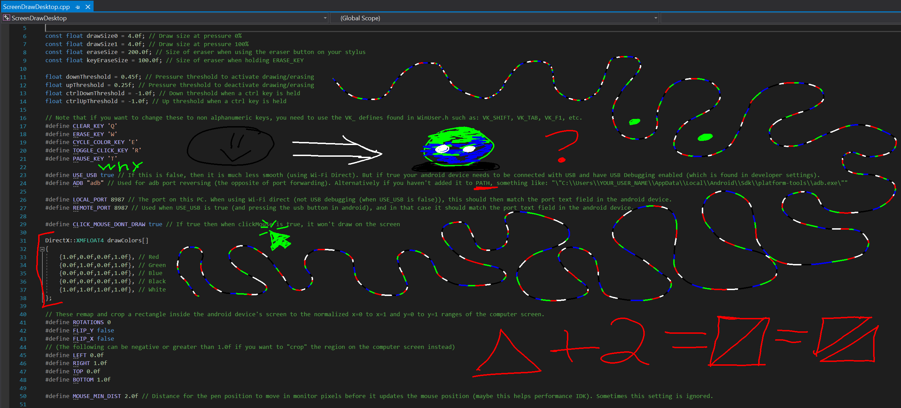

Designed for my specific needs, so the user settings for the windows server (ScreenDrawDesktop.exe) can only be changed by modifying the source code (ScreenDrawDesktop/ScreenDrawDesktop.cpp):

and then recompiling (should be as easy as pressing f6 or f5 with ScreenDrawDesktop.sln open in Visual Studio (2019 at least)).

GarbageScreenDrawDesktop is as its name implies, pure garbage. I wanted to try WPF out but the performance was trash, so then I tried Windows Desktop Application ( which works much better :) ).

Other things to know:
- Uses either Wi-Fi Direct or USB Debugging (using adb port reversing (the opposite of adb port forwarding)). I recommend USB mode, as it's MUCH smoother. You need to have the file adb.exe, either added to the PATH environment variable, or modify ScreenDrawDesktop.cpp's "ADB" define to use the path to your adb.exe file (refer to the comment for the formatting). If you don't do that, it will only work with Wi-Fi Direct.
- Cycle through colors with E key, hold W to erase (or use eraser button), press Q to clear the screen, press R to toggle mouse click mode (with draw mode it draws on the screen, with mouse click mode it clicks and drags the mouse cursor instead), press T or click on the icon to pause.
- Clicking on the icon in the task bar enables/disables it.
- This only works on one monitor (I believe the main monitor).
- You can't pin ScreenDrawDesktop.exe to the task bar, nor use a shortcut to open it (idk why), otherwise the icon won't update to show if it's enabled or disabled. To open the program without a shortcut I made the batch file "Launch Screen Draw Desktop.bat",
which you are able to use a shortcut to without breaking the icon.
- Renders using DirectX 11.
- Maybe my android device and/or its stylus is weird, but otherwise android just won't give the position of a hovering Wacom EMR stylus, only when it's touching the surface, which is why this project exists (I wanted to see for myself if it really was impossible to make it behave like a Wacom drawing pad). If specifically my hardware is the limiting factor, this project should disable threshold stuff.
  
